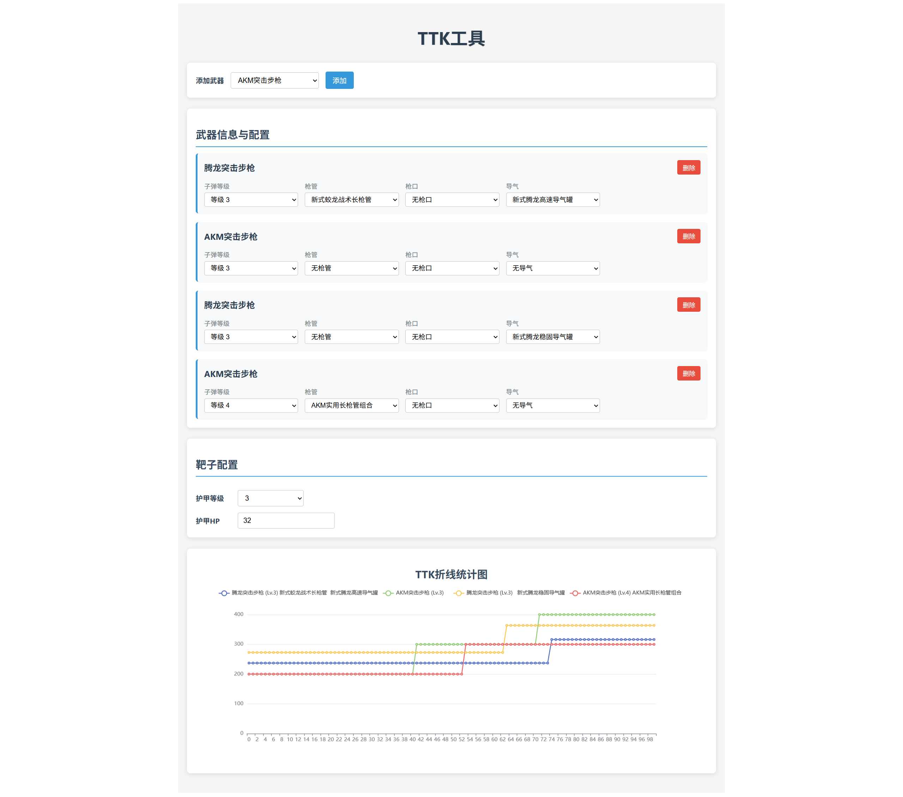

# DF-WEAPONTOOL

一个基于 Vue 3 + TypeScript + Vite 的武器 TTK（击杀时间）计算工具。该应用程序允许用户配置武器、目标护甲设置，并可视化 TTK 统计数据。



## 功能特性

- 🎯 武器配置：选择不同武器并自定义配件
- 🛡️ 护甲系统：设置目标护甲等级和生命值
- 📊 数据可视化：实时显示 TTK 折线统计图
- 📱 响应式设计：支持桌面和移动设备
- ⚡ 高性能：基于 Vite 构建，快速开发和构建

## 技术栈

- [Vue 3](https://v3.vuejs.org/) - 渐进式 JavaScript 框架
- [TypeScript](https://www.typescriptlang.org/) - JavaScript 的超集
- [Vite](https://vitejs.dev/) - 新一代前端构建工具
- [Pinia](https://pinia.vuejs.org/) - Vue 的状态管理库
- [ECharts](https://echarts.apache.org/zh/index.html) - 数据可视化库

## 项目结构

```
src/
├── App.vue          # 主应用程序组件
├── main.ts          # 应用程序入口点
├── stores/
│   ├── weapon.ts    # 武器数据管理
│   └── accessory.ts # 配件数据管理
├── utils/
│   └── ttk.ts       # TTK 计算工具函数
└── assets/          # 静态资源文件
```

## 开发指南

### 安装依赖

```bash
npm install
```

### 启动开发服务器

```bash
npm run dev
```

### 构建生产版本

```bash
npm run build
```

### 预览生产构建

```bash
npm run preview
```

## 使用说明

1. **添加武器**：从下拉菜单中选择武器，点击"添加"按钮
2. **配置武器**：
   - 选择子弹等级（1-5级）
   - 选择配件（枪管、枪口、导气）
3. **设置目标**：
   - 选择护甲等级（0-6级）
   - 设置护甲生命值（仅当护甲等级不为0时）
4. **查看结果**：TTK 折线图将实时显示不同距离下的击杀时间

## 数据模型

### 武器接口
- `name`: 武器名称
- `damage`: 基础伤害
- `armorDamage`: 护甲伤害
- `fireSpeed`: 射速
- `ranges`: 射程段
- `decays`: 衰减段
- `availableAccessories`: 可用配件 ID 列表

### 配件类型
- `barrel`: 枪管
- `muzzle`: 枪口
- `gasComp`: 导气

## 计算逻辑

TTK 计算公式：
```
TTK = (60 / RPM) * (ShotsToKill - 1) * 1000 ms
```

考虑因素：
- 子弹等级对伤害的影响
- 护甲等级和生命值
- 距离衰减
- 配件加成

## 贡献

欢迎提交 Issue 和 Pull Request 来改进这个工具。

## 许可证

[MIT](LICENSE)